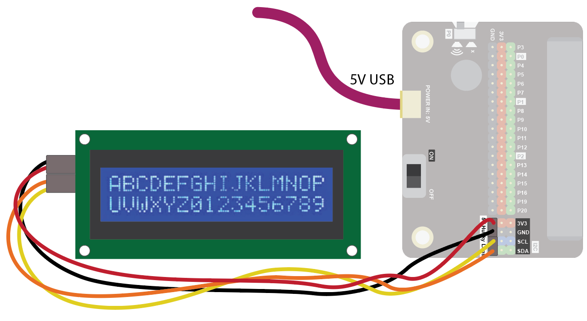
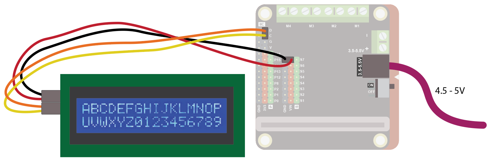
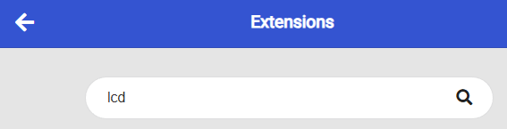
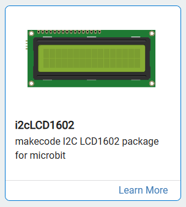
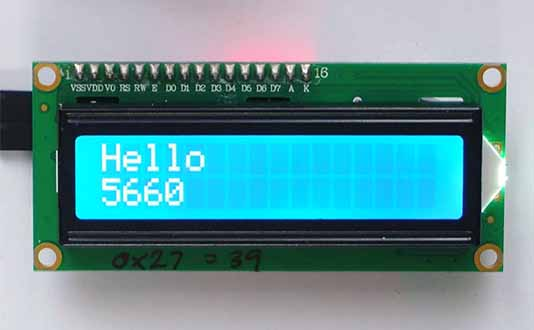
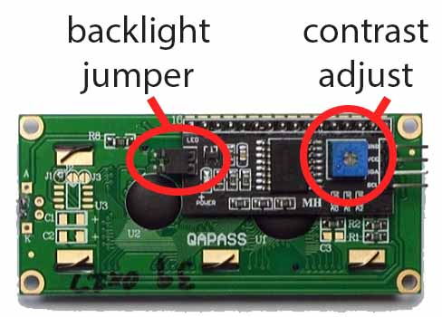

## 16x2 LCD DISPLAY
Using an I2C backpack with your 16x2 LCD display makes it much easier to connect to a micro:bit, as it reduces the required wiring down to just four pins (VCC, GND, SDA, and SCL). This is ideal for showing real-time data from your color sensor—such as displaying the exact RGB values or a matching color name right on the screen as you test different objects or light sources.
Use it to display short messages!

### Quick Reference
### Wiring
Connect each wire to its corresponding pin on your micro:bit or breakout board:

Red to 3V3 (Power)

Black to GND (Ground)

Yellow to SCL (Clock line)

Orange to SDA (Data line

Wire up as follows, using the Edge Connector or Motor Controller board:

16x2 LCD Display	Edge Connector	Motor Controller
Red	5V	Vin
Black	GND	G
Yellow	SCL	C
Orange	SDA	D
Note that the LCD display needs arounf 4.5 - 5V to work well, but the Microbit only gives 3.3V. So we need to ensure we add additional power.

On the edge connector wire it like this, using the 5V "Husky Lens" pins to connect the display and an additional 5V power from a USB input (this can come from a USB port on your computer or a USB power bank):

On the motor controller wire it like this, using the servo connector GND and VIN pins, and a power input such as 3AA batteries:

### Coding
Scroll to the bottom of the block categories, select **Extensions**, type `lcd1602` into the search bar, and click on the package to install it.

**How to verify:** You should see a new **LCD1602** category appear in your block menu on the left side of the screen.

Then search for "lcd":

Then click on the i2cLD1602 extension:

You should see a new block appear:

Enter this code in on start and forever blocks:

Download the code to the microbit.

The code will show "Hello" on the top line and a random number on the bottom line. The random number changes every half second:

Note that if the message is not displaying clearly, you can adjust the blue screw on the back of the display to control the contrast. The backlight jumper needs to be present for the backlight to be on:

 