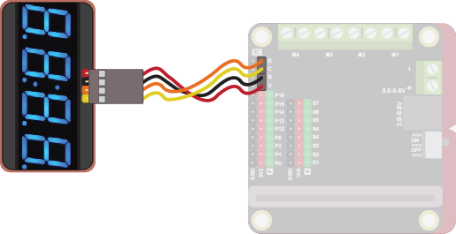
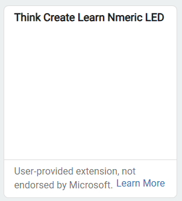
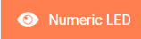
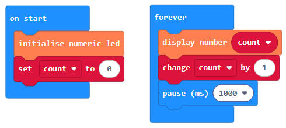
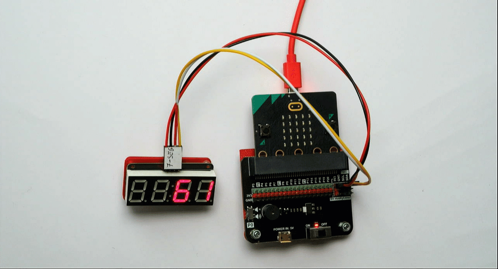

.v["title"] = "Reference - Numeric LED - Think Create Learn" .v["heading1"] = "Numeric LED" .v["heading2"] = "The numeric LED can be used to display up to 4 numbers." .v["intro"] = "

Use it to keep score, show the time and much more!

"
Quick Reference
Wiring
Use a special cable (7-seg) to connect the sensor. This has 4 wires, white, yellow, red and black:

Wire up as follows, using the Edge Connector or Motor Controller board:

Numeric Display	Edge Connector	Motor Controller
Red	3V3	V
Black	GND	G
Yellow	SCL	C
Orange	SDA	D
On the edge connector it should look like this:

On the motor controller it should look like this:

Coding
You will need to add an extension to get additional blocks for the numeric LED. Click on the extensions block:

Then search for github:lewfer/mb-numeric-led. The following should appear:

Click on it. You should see a new block appear:

Enter this code in on start and forever blocks:

Download the code to the microbit.

The code creates a simple counter, displaying the number of seconds that have elapsed since the start:

.navBack("BitMakeLab main page")