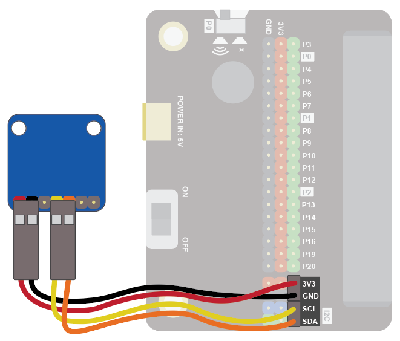
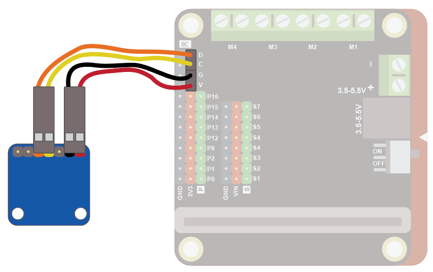
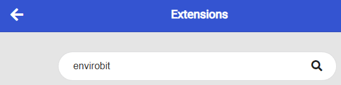
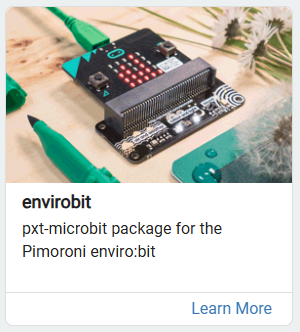
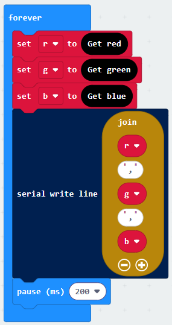
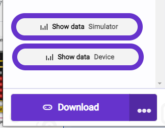
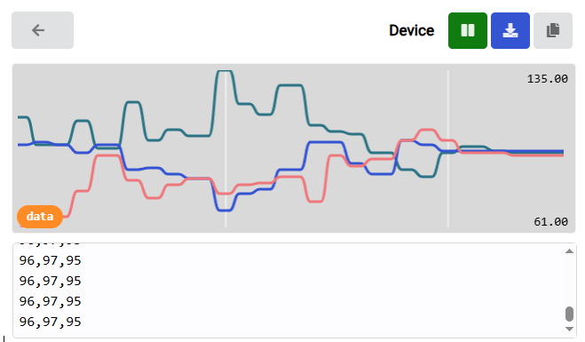
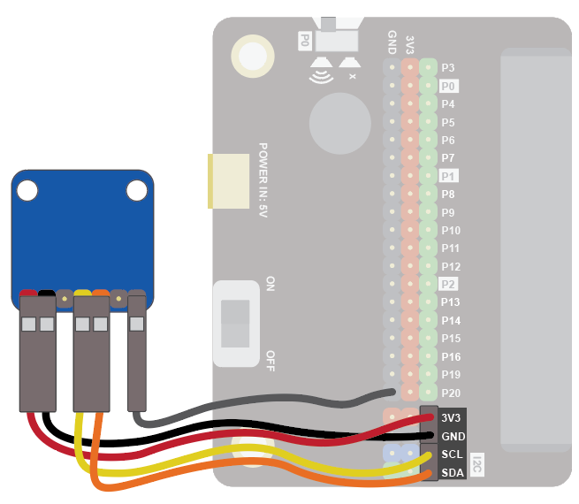

## Colour Sensor

These projects typically rely on reading RGB (Red, Green, Blue) values to differentiate between shades. For a color sorter, you can pair the sensor with a servo motor to physically sweep objects into different bins, while a fruit ripeness detector can be programmed to display a specific message or icon on an LED matrix once the target color threshold is reached.
"
### Quick Reference
For the official documentation, you can check the [Adafruit TCS34725 Color Sensor Guide](https://learn.adafruit.com/adafruit-color-sensors). Let me know if you would like help formatting this into a complete tutorial, adding MicroPython code examples, or expanding on any other sections!
### Wiring
Use the I2C cable to connect the sensor. This has 4 wires in 2 pairs: orange-yellow and red-black:

Wire up as follows, using the Edge Connector or Motor Controller board:

| Colour Sensor | Suggested wire colour | Edge Connector | Motor Controller |
| --- | --- | --- | --- |
| VIN | Red | 3V3 | V |
| GND | Black | GND | G |
| SCL | Yellow | SCL | C |
| SDA | Orange | SDA | D |

On the edge connector it should look like this:

On the motor controller it should look like this:

### Coding
You will need to add an extension to get additional blocks for the display. The envirobit extension from Pimoroni is for their envirobit device, which has a colour sensor. We can use this extension to control our colour sensor. Click on the extensions block:

Then search for "enviro":

Then click on the envirobit extension:

You should see a new block appear:

Enter this code in the forever block:

Download the code to the microbit.

Colours are defined by the amount of red, green and blue detected. The above code reads each of these components and sends the data to the serial port.

To see the data, click on Show data Device:

You should see some numbers and a graph. These show the colour components. Place different coloured objects about 1cm in front of the sensor. The colour components detected will change accordingly:

### Notes
To accurately measure the color of a light source like a lamp, you should disable the color sensor's built-in LED so it doesn't interfere with your readings. Simply run an extra wire from the sensor's LED pin to a GND pin on the micro:bit.

 
